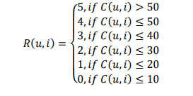
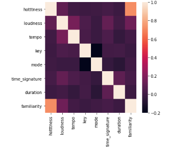
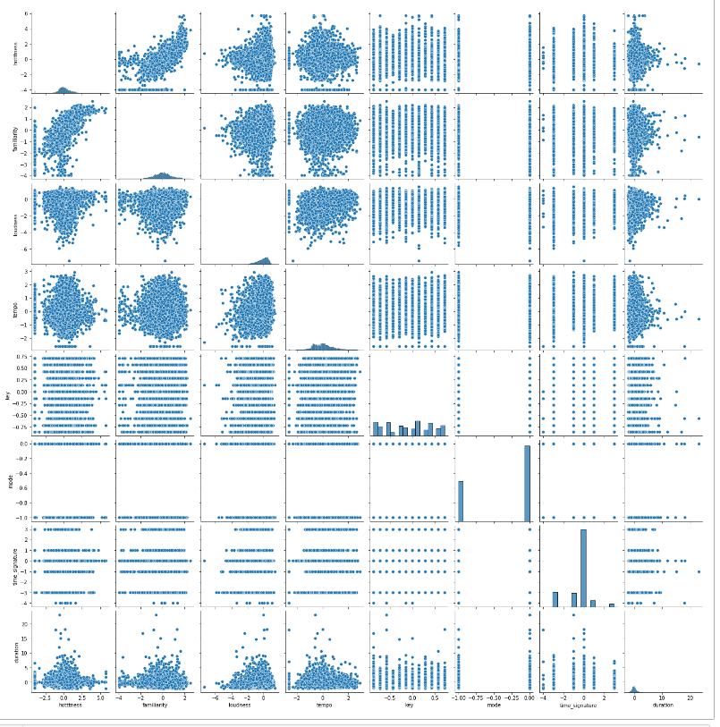
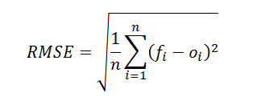
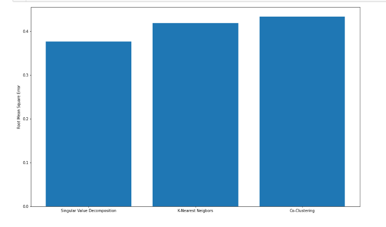
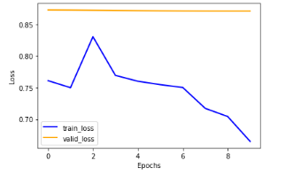
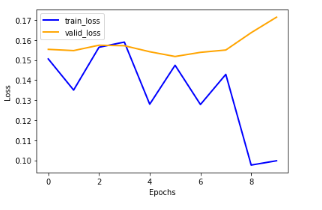

## Problem

With growing number of services online that are used for commercial and entertainment purposes, there has emerged a need to filter through all the vast data available to offer customers best products and services they might be interested in. That is the crux of the problem recommender systems are aiming at solving, as they answer questions like how do companies like Spotify recommend songs to users that they might actually like?

In this project I focus on creating a recommendation engine that will recommend songs to users using various approaches outlined below.

## Dataset

The source of data will be Million Songs Dataset (that contains song features) and its complementary user dataset that can be downloaded [here](http://millionsongdataset.com/).

Since the whole dataset is 240GB, a random sample of 10000 songs was used.

Interesting features that were used from song features dataset:
- `hotttness` - how popular artist of the song was at recording time
- `duration` - duration of the song
- `loudness` - loudness of the song
- `tempo` - beats per minute of the song
- `familiarity` - how familiar users are with the artist
- `key` - what scale the song is built around
- `mode` - indicates if song is in major or minor scale
- `time signature` - number of beats per bar

The other, user dataset has a format of triplets as (user, song, number of times played).

## Data preprocessing

As suggested in [this paper](https://www.uvm.edu/~ylin19/files/Music_Recommer_System_Report.pdf) that focuses on solving the same problem, instead of trying to predict play count that can have arbitrary range of values, preprocessing step is applied to put play count in a [0, 5] range that is more similar to what a rating would look like. As exact number of of plays user might make isn't important for this use case, this project applies same preprocessing step. 

Rules for this transformation are given below, for user `u` on item `i` based on listen count `C(u, i)`:

## Data Analysis

For features mentioned previously, a Pearson correlation matrix was computed. Heatmap of that correlation matrix can be seen below:

From the image above, we can conclude that hotttness and familiarity are linearly correlated, which makes sense as both measure the popularity of the artist. The pairwise distributions of features depicted below confirm the same thing.

The dataset is split in 8:2 ratio in training and test. The models listed below are trained to predict the number of times a user would have played a song.

The models are evaluated on Million Songs Dataset using RMSE metric, defined as: 

## Solution

Standard models for recommenders work with two kinds of data:
- user-item interactions, such as ratings or number of interactions (plays in our case) (*collaborative filtering*)
- attribute information about the user and the item (*content based*)

It is possible however to use deep learning model to solve collaborative filtering problems. I have used [fastai](https://www.fast.ai/) library to test this approach.

Various collaborative filtering and content based approaches were tested in this project and overview of these is given below:

### Content-Based model

The content-based approach uses attribute information about the user and items (songs in this case). More about the approach can be read [here](https://www.google.com/search?q=content+based+recommender&oq=content+based+recommender&aqs=chrome..69i57.2546j0j1&sourceid=chrome&ie=UTF-8). KNN model is used to predict songs that are closest (top n recommendations that should be made to the user) based on similarities of the song features. For testing which hyperparameters work best, precision and recall metrics were used and different parameter values tested. Analysis was done for features that should be taken into consideration that describe particular song, distance metric used for KNN and also the number K for KNN algorithm. Results of this analysis can be seen in [this](./analysis/KNN_Analysis.ipynb) file. Feature values were scaled down to [0, 1] range so there is no higher priority for particular features and similarity among them when using KNN.

### Collaborative Filtering models

Collaborative filtering recommender systems rely on particular actions user perform on an item, such as rating, playing, buying etc. Simplest CF systems use user-item or item-item approaches where similar users or similar items are searched and recommended to a particular user. These are called memory based approaches and these don't scale well for growing number of users or items.

Model based CF systems, on the other hand, use ML models that have some parameter optimization. Such models are tested on this dataset as well and test RMSE metric plot is given below:

### Hybrid model

To avoid cold-start problem that collaborative filtering methods have, a hybrid model between content based and collaborative filtering can be used. Content based serves as a helpful fallback for cases where new user or new item arrives so predictions can't be made based on user or item history. Also analysis was done on what threshold should be chosen for the number of interactions a user should have for it to rely only on collaborative filtering approach. Doing the analysis showed that `50` is a good candidate. More on this can be seen in [this file](./Hybrid_ContentBased_CF.ipynb).

### Deep Learning model

Latent-factor model based methods use machine learning and data mining to summarize the data thus avoiding the computation of similarity (user-user or item-item similarity).

FastAI offers two models, `EmbeddingDotBias` and `EmbeddingNN` for DL recommender purposes. EmbeddingDotBias is a Pytorch model used to find embeddings using multi-layer perceptron without biases and with one hidden layer. EmbeddingNN approach, on the other hand, creates a deeper Neural Network suitable for collaborative filtering. It is expected that EmbeddingNN, due to it's bigger complexity of layers is a slower but far more accurate. To see analysis of both models, refer to [this](./DeepLearning_CF_Approach.ipynb) notebook.

Learning rate is considered to be one of the most important hyperparameters as it decides on how fast we approach towards minima. Instead of trying to guess what value should be used, one cycle policy is used. More on that can be found [here](https://sgugger.github.io/the-1cycle-policy.html).

Below is the loss achieved when training `EmbeddingDotBias`:

Plotted train/validation loss for `EmbeddingNN` is given below:

As expected, `EmbeddingNN` model proved to be more accurate based on the validation loss.